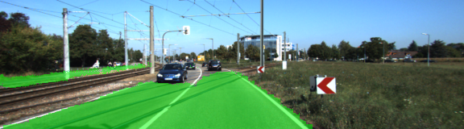
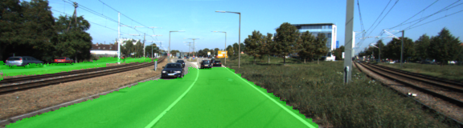
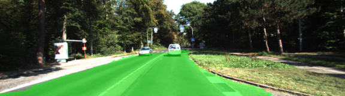
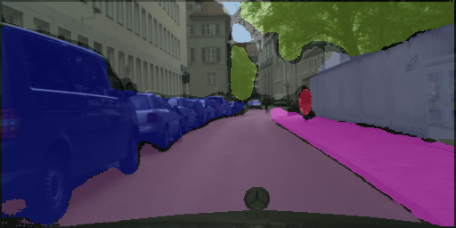
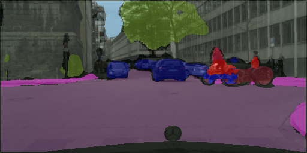
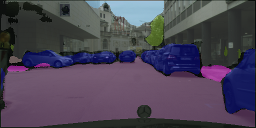
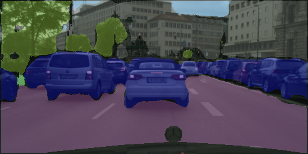
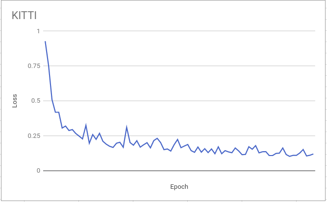

# Semantic Segmentation
### Introduction
In this project, we'll label the pixels of a road in images using a Fully Convolutional Network (FCN).

Link to original [paper](https://people.eecs.berkeley.edu/~jonlong/long_shelhamer_fcn.pdf)

### Setup
##### Frameworks and Packages
Make sure you have the following is installed:
 - [Python 3](https://www.python.org/)
 - [TensorFlow](https://www.tensorflow.org/)
 - [NumPy](http://www.numpy.org/)
 - [SciPy](https://www.scipy.org/)

This project uses MoviePy to pocess video. If this is your first time running MoviePy, and you get FFmpeg error, locate the following:

```python 
from moviepy.editor import VideoFileClip
```
and add this above. It only needed to be done once.

```python
import imageio
imageio.plugins.ffmpeg.download()
```

##### Dataset
###### Kitti
Download the [Kitti Road dataset](http://www.cvlibs.net/datasets/kitti/eval_road.php) from [here](http://www.cvlibs.net/download.php?file=data_road.zip).  Extract the dataset in the `data` folder.  This will create the folder `data_road` with all the training a test images.

###### Cityscape
Register at [The Cityscapes Dataset](https://www.cityscapes-dataset.com/downloads/). Download gtFine_trainvaltest.zip and leftImg8bit_trainvaltest.zip. Extrac both to `data` folder such that you have `data/gtFine` and `datas/leftImg8bit`.

### Start
##### Run
Run the following command to run the project:
```
python main.py
```
##### Kitti Results

###### Mean IOU: 0.960






##### Cityscape Results






##### Cross-entropy Loss



#### Tips
- The link for the frozen `VGG16` model is hardcoded into `helper.py`.  The model can be found [here](https://s3-us-west-1.amazonaws.com/udacity-selfdrivingcar/vgg.zip)
- The model is not vanilla `VGG16`, but a fully convolutional version, which already contains the 1x1 convolutions to replace the fully connected layers.

#### Attribution
###### Datasets
[Kitti Road dataset](http://www.cvlibs.net/datasets/kitti/eval_road.php)

[The Cityscapes Dataset](https://www.cityscapes-dataset.com/downloads/)

###### Cityscape helper scripts: 
https://github.com/mcordts/cityscapesScripts 
 